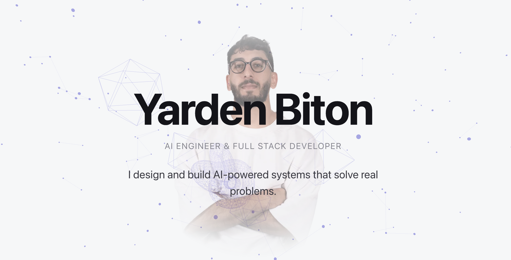

# Yarden Biton — Portfolio

A light, scroll-driven personal portfolio for **Yarden Biton**, AI Engineer & Full-Stack Developer. It pairs an elegant snow-white design with a persistent, interactive **Three.js** background (a particle network + floating wireframe geometries) and **GSAP**-driven scroll choreography — built on Next.js 15 and the App Router.

🔗 **Live:** [portfoliojordan-liard.vercel.app](https://portfoliojordan-liard.vercel.app)



---

## ✨ Highlights

- **Persistent 3D canvas** — a single fixed Three.js scene behind all content: an instanced particle network with dynamic connecting lines, indigo wireframe geometries at varied depths, and subtle mouse interaction.
- **Scroll choreography** — GSAP `ScrollTrigger` drives the scene per section (particles cluster/spread, camera zooms, accent intensifies, everything calms at the end).
- **Accessible by default** — honors `prefers-reduced-motion` (animations off, scene static), keyboard-navigable menu, semantic HTML, and a WebGL fallback gradient when the GPU is unavailable.
- **Case studies** — each project links to a detailed write-up (problem → architecture → tech decisions → challenges).
- **Tested** — unit tests for content/structure, accessibility, reduced-motion logic, and the WebGL fallback, with CI on every push.

---

## 🛠 Tech Stack

| Area | Tech |
|------|------|
| Framework | [Next.js 15](https://nextjs.org) (App Router, Turbopack) |
| Language | [TypeScript 5](https://www.typescriptlang.org) (strict) |
| UI | [React 19](https://react.dev) |
| Styling | [Tailwind CSS v4](https://tailwindcss.com) (CSS-first config, design tokens) |
| 3D | [Three.js](https://threejs.org) |
| Animation | [GSAP](https://gsap.com) + ScrollTrigger |
| Icons | [react-icons](https://react-icons.github.io/react-icons/) |
| Testing | [Vitest](https://vitest.dev) + [React Testing Library](https://testing-library.com) (jsdom) |
| CI/CD | GitHub Actions · [Vercel](https://vercel.com) |

---

## 📁 Repository Structure

```
.
├── app/                      # Next.js App Router
│   ├── layout.tsx            # Root layout — fonts (Space Grotesk, Inter, JetBrains Mono)
│   ├── page.tsx              # Home — Scene3D + section composition
│   ├── globals.css           # Design tokens (light theme), typography, fallback styles
│   └── projects/[slug]/      # Per-project case-study pages (SSG)
├── components/               # Section + UI components (each with a co-located test)
│   ├── Scene3D.tsx           # Persistent Three.js background canvas
│   ├── Navbar.tsx            # Hidden → reveal-on-scroll nav + hamburger overlay
│   ├── Hero.tsx              # Hero with GSAP entrance + profile portrait
│   ├── About.tsx             # Scroll-triggered manifesto reveal
│   ├── Projects.tsx          # Project cards with continuous scroll flow
│   ├── Skills.tsx            # Skills grid with stagger
│   ├── ClaudeSkills.tsx      # Custom Claude skills showcase
│   └── Contact.tsx           # Closing section + links
├── data/
│   └── content.ts            # Single source of truth: personal, projects, case studies, skills
├── lib/                      # Pure, unit-tested helpers
│   ├── scene-config.ts       # Responsive 3D budget (particle/geometry counts, pixel ratio)
│   ├── webgl.ts              # WebGL feature detection
│   └── motion.ts             # prefers-reduced-motion helper
├── public/                   # Static assets (images, CV, project screenshots)
├── .github/workflows/ci.yml  # CI: typecheck + tests + build
├── vitest.config.ts          # Test runner config
└── vitest.setup.ts           # Test environment setup + mocks
```

---

## 🚀 Getting Started

```bash
# install
npm install

# run the dev server (http://localhost:3000)
npm run dev

# production build
npm run build && npm start
```

### Scripts

| Script | Description |
|--------|-------------|
| `npm run dev` | Start the dev server (Turbopack) |
| `npm run build` | Production build |
| `npm start` | Serve the production build |
| `npm run typecheck` | `tsc --noEmit` |
| `npm test` | Run the Vitest suite |
| `npm run test:watch` | Vitest in watch mode |

---

## 📨 Contact

- **GitHub:** [github.com/Jordan1881](https://github.com/Jordan1881)
- **LinkedIn:** [yarden-biton](https://www.linkedin.com/in/yarden-biton-771026215/)
- **Email:** jordanstu21@gmail.com
